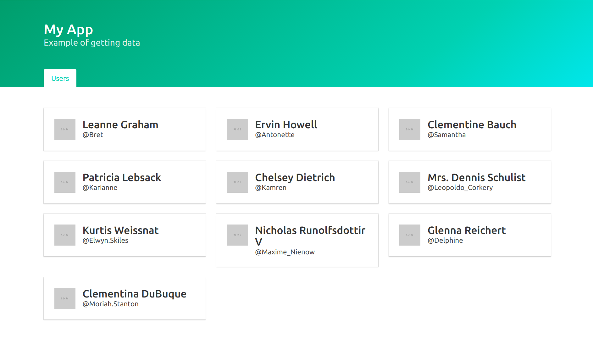

# Angular 5 - Example of Data Resolving and NGRX

A demonstration of various ways to resolve data in Angular 2, 4 and 5.
Starting basic, and then progresses through using Router Resolvers, and 
NgRx Actions and Effects.

Click the tag/version number below to browse each version 
by switching to the tag in GitHub, or download 
tagged versions from the [GitHub releases page](../../releases).

The data used in this example comes from the 
[JSONPlaceholder](https://jsonplaceholder.typicode.com/) service.

## Initial version ([tag v0](../../tree/v0))

Created a `UserService` to load some dummy contact/user data.
A naive implementation that injects this service into 
components, and the components load the data they need by
making HTTP calls to the webservice via the injected service.
I added a `delay(1000)` to the service calls to simulate 
a slow network.

Components can be instantiated without data so need some way of
checking that data exists before trying to show it in the template.
Added some simple feedback to show when data is being loaded from
the server, but lots of room for improvement. 

## User List Resolver ([tag v1.1](../../tree/v1.1))

First change is to pre-fetch the data before displaying the component.
The Angular Router supports adding resolvers. This returns an observable
that will resolve the required data. 

## User Resolver ([tag v1.2](../../tree/v1.2))

Added another resolver for user data. This one reads the `:id` param
and resolves data for a specific user. 

Single responsibility principle broken by the fact our components are 
doing too much. We've helped by separating out the loading of data to 
the Router resolver. That's one less thing for them to do.

Routing now waits for the data to be resolved before the new route 
is displayed. Good because we know in the components that we will
always have data, but with the current setup, there's a noticeable 
delay. We no longer get the loading feedback that we designed into 
the first approach.

## Container components ([tag v2](../../tree/v2))

Another popular pattern is to split components into container and 
presentational components. Let's move even closer toward single 
responsibility principle by refactoring the components split out
the bits related to presentation into separate components.

The contact list component was converted to a container component
and it's presentation was moved to the contact card component.
The contact detail component was converted to a presentational
component, and a new contact page component was added as it's
container.

## ngrx store ([tag v3](../../tree/v3))

Before making further improvements, need to complicate things 
a bit by adding the store. It might seem like a load of boilerplate
at first, but later will make improvements easier. Adding things
like improvements to async functionality, caching, etc.

In this version there is one global store for all the application
state. The components select which part of the store they are 
interested in. The presentation components do not need to change
from before because they are still just dumb components that are 
passed data to display. The container components however are changed.
The container component does as select of the part of the store
it is interested in, which is given to the component as an 
Observable. This is subscribed to in the template using the 
async pipe. The components also dispatch a load action to 
prompt the loading of the data they require. In the case of the
list this is a general action with no payload. The detail page
first gets the ID parameter from the router, then uses this
to dispatch an action to load the specific item.

The actual loading is managed as Effects as part of the store.
In this version you will find all the store related code 
(actions, reducers, effects) in the `shared/store` directory.

## ngrx entity ([tag v4](../../tree/v4))

Rather than having a separate state for the user list and the 
selected user detail, I've consolidated this into a single 
repository of user entities. Using the ngrx entity library
cuts down on the boilerplate code needed to do this.

I've replaced the two sets of actions, effects and reducers with
a single `user` reducer. This maintains a single set of `Partial<User>`
entities. The summary list fills in the basic data for all users 
that are available. Then, a user page can be displayed quickly
but with a limited amount of data. The HTTP request is sent off 
to fetch the detailed data, which is added to the record in the 
store. This is then available if the user navigates away from 
the page, and returns later. 

The caching is only during the single session, because there
is no integration with browser local storage yet.

## loading feedback ([tag v5](../../tree/v5))

When you navigate to a contact page for a user that has not
yet been fetched in detail, you see just the summary fields
until the rest is loaded. I'd like to show some feedback that
a server request is in process. 

Af first I thought about adding a flag to the user
model to show if it's partial or fully loaded, but this feels
dirty to add something to the data model purely for UI 
purposes. Instead I've opted to add a separate set of flags
to the store.

## TODO: 

 - ngrx/db, pouchdb, localforage or some other local data store
 - graceful handling of api errors
